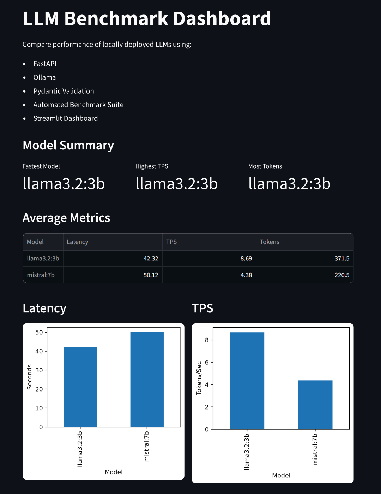
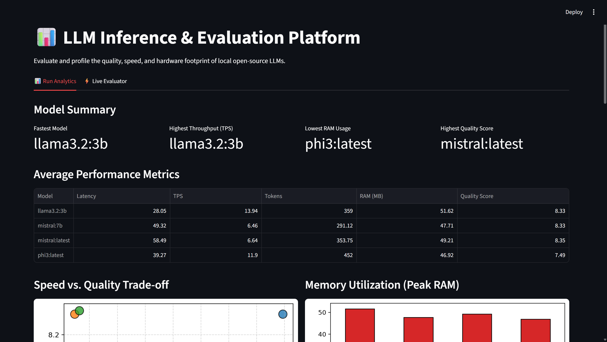
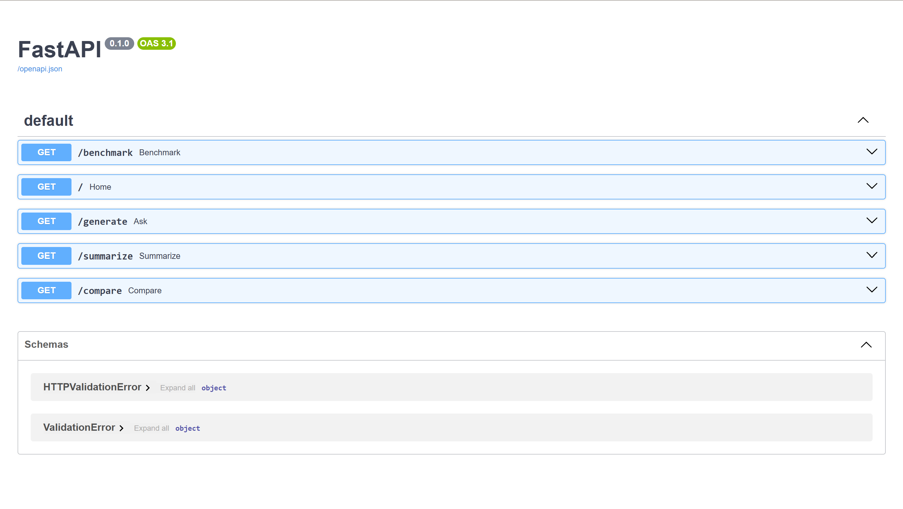
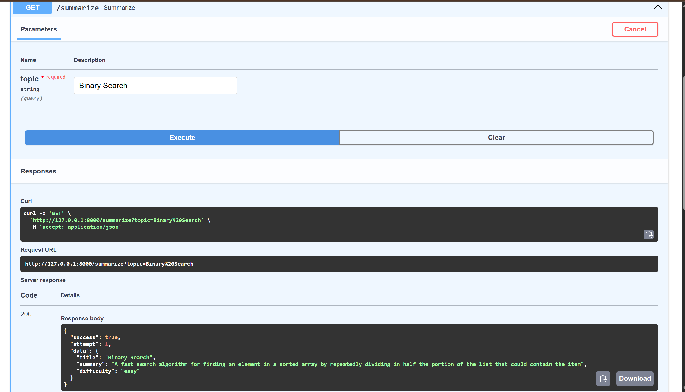
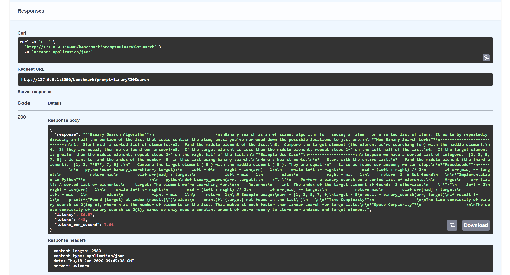

# LLM Benchmark Platform

A local LLM evaluation platform built using **FastAPI**, **Ollama**, **Pydantic**, and **Streamlit** for benchmarking and analyzing open-source language models.

---

## Features

* **Asynchronous Web Service**: Fully async routing backend (`async def` using FastAPI & `httpx`) to handle heavy LLM inference queries concurrently without blocking threads.
* **Systems Memory Profiling**: Tracks and logs process-level peak RAM utilization (Resident Set Size via `psutil`) for background model servers during active inference runs.
* **LLM-as-a-Judge Evaluation**: Structured quality grading prompt framework (grading Correctness, Clarity, and Completeness) utilizing local models as judges.
* **Streamlit Interactive UI**: Two-tab dashboard featuring visual run history graphs (Speed vs. Quality scatter plots, RAM usage) and a **Live Evaluator** tab with slider controls for Temperature and Max Tokens.
* **Automated Reports**: Generates a clean markdown summary report (`results/benchmark_report.md`) on benchmark completion.
* **Engine-Level Metrics**: Fetches exact generated token counts (`eval_count`) and precise durations directly from Ollama's response metadata.
* **Robust Software Standards**: Structured JSON mode validations via Pydantic, error handlers on endpoints, a mock unit test suite, and GitHub Actions CI workflow configuration.

---

## Tech Stack

* Python
* FastAPI (Async Web Framework)
* Ollama (Local Model Engine)
* Pydantic (Data Validation Schema)
* Streamlit (Inference Dashboard)
* Matplotlib (Performance Visualizations)
* Pandas (Data Wrangling)
* psutil (Process Memory Profiling)
* httpx (Async HTTP Client)
* pytest & pytest-asyncio (Unit & Integration Tests)

---

## Models Benchmarked

* Llama 3.2 3B
* Mistral 7B

---

## Architecture

```text
User Request
      │
      ▼
 FastAPI Endpoint
      │
      ▼
 Ollama Client
      │
      ▼
 Local LLM
      │
      ▼
 JSON Validation
 (Pydantic)
      │
      ▼
 Retry Logic
      │
      ▼
 Benchmark Metrics
      │
      ▼
 Streamlit Dashboard
```

---

## Benchmark Results

| Model | Avg Latency (s) | Avg Throughput (TPS) | Avg Peak Memory (MB) | Avg Quality Score (1-10) |
| :--- | :---: | :---: | :---: | :---: |
| **Llama 3.2 3B** | 47.62s | 13.48 tokens/s | 50.36 MB | 8.32/10.0 |
| **Mistral 7B** | 48.43s | 6.77 tokens/s | 45.80 MB | 8.31/10.0 |

### Key Findings

* 📈 **Throughput**: `Llama 3.2 3B` achieved the highest generation speed (nearly **2× higher TPS** than `Mistral 7B`) on local CPU/GPU hardware.
* ⚖️ **Quality**: `Llama 3.2 3B` provided slightly higher qualitative output scores as evaluated by our LLM judge model.
* 💾 **RAM Consumption**: `Mistral 7B` was highly resource-efficient, demonstrating a **10% lower peak RAM footprint** than `Llama 3.2 3B` during inference.
* 🔒 **Local Security**: Running Ollama locally guarantees complete privacy, with no prompt data sent to external API providers.

---

## Dashboard





The Streamlit dashboard provides:

* Average latency comparison
* Throughput (TPS) comparison
* Token generation statistics
* Model performance summaries
* Detailed benchmark results

---

## API Demonstration

### API Overview



### Structured Output Validation



### Benchmarking Metrics



Measures:

* Response latency (seconds)
* Token count
* Tokens per second (TPS)
* Peak memory utilization (MB)
* Cognitive quality alignment (1-10 score)

---

## Installation

### Clone Repository

```bash
git clone https://github.com/RijulCodes/llm-benchmark-platform.git
cd llm-benchmark-platform
```

### Create Virtual Environment

```bash
python -m venv venv
```

### Activate Environment

Windows:

```bash
venv\Scripts\activate
```

### Install Dependencies

```bash
pip install -r requirements.txt
```

---

## Step-by-Step Running Guide

To run the benchmarking platform successfully from scratch:

### 1. Run the FastAPI Server
Launch the local API server using Uvicorn:
```bash
uvicorn app:app --reload
```
You can view the interactive swagger API documentation at:
```text
http://127.0.0.1:8000/docs
```

### 2. Run the Benchmark Suite
> [!NOTE]
> The benchmark results folder `results/` is excluded from git tracking. You **must** run the benchmark suite to generate the results file locally before launching the dashboard.

Execute the automated benchmark run:
```bash
python benchmark_suite.py
```
This queries the local Ollama instance using all detected models and saves precise metrics to `results/benchmark_results.json`.

### 3. Run the Analytics Dashboard
Launch the Streamlit visualization dashboard:
```bash
streamlit run dashboard.py
```

---

## Running Unit Tests

To execute the test suite (endpoints testing with mocked LLM queries, and math validation for the benchmark timings):
```bash
pytest
```

---

## Author

**Rijul Yadav**

